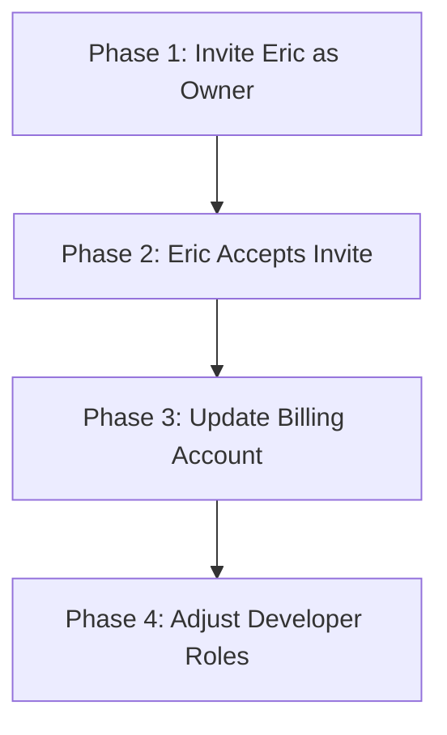

# UpfittersOS: Firebase Project Ownership Transfer Guide

This document outlines the step-by-step process for transferring full ownership and billing of the production Firebase project (`saegroup-c6487`) from a personal account to Eric / SAE Customs' corporate accounts.

---

## Overview of the Transfer Workflow
By performing an ownership transfer, we achieve **zero downtime**, **zero code modification**, and **zero risk of data loss**. The workflow consists of four simple phases:

---

## Phase 1: Invite Eric/SAE Accounts as Owners
*Action by: **Current Project Owner** (Personal Account)*

1. Navigate and sign in to the [Firebase Console](https://console.firebase.google.com/).
2. Select the project: **`saegroup-c6487`**.
3. In the left-hand sidebar, click the gear icon next to **Project Overview** and select **Project settings**.
4. Click on the **Users and permissions** tab.
5. Click the **Add member** button.
6. Enter the Google/Google Workspace email addresses for Eric and any other SAE Customs administrators.
7. Under **Role(s)**, select **Owner**.
8. Click **Add member** to send the invitation.

---

## Phase 2: Accept the Invitation
*Action by: **Eric / SAE Customs Administrators***

1. Have Eric check his inbox for an email from Google Firebase with the subject: **"Invitation to join saegroup-c6487 on Firebase"**.
2. Click the **Accept Invitation** link in the email.
3. Eric will be redirected to the Firebase Console. Follow the prompts to authenticate and confirm acceptance of the project ownership role.

---

## Phase 3: Transition Project Billing
*Action by: **Eric / SAE Customs Administrators** (Once they have accepted the invitation)*

To transfer the financial responsibility of the project from the developer's personal account to SAE Customs:

1. Sign in to the [Google Cloud Console Billing Page](https://console.cloud.google.com/billing).
2. Ensure the SAE Customs billing account/credit card is active and configured in this account.
3. In the Google Cloud Console, select the project **`saegroup-c6487`** from the project dropdown at the top of the page.
4. In the left sidebar navigation, select **Billing**.
5. Click **Change billing account** (or **Link a billing account**).
6. Select the corporate **SAE Customs Billing Account** from the list.
7. Click **Set Account** to save the changes.
8. Verify that the previous personal billing account is now disassociated and no longer billed for project operations.

---

## Phase 4: Adjust & Clean Up Permissions
*Action by: **Eric / SAE Customs Administrators***

Once Eric has full ownership and billing is active under SAE Customs, you can optionally adjust the original personal account's permissions to maintain a secure structure while still allowing development:

1. In the **Users and permissions** tab of the Firebase Console, find the developer's personal email.
2. Change the role from **Owner** to one of the following:
   * **Editor:** Allows full deployment of Hosting, Cloud Functions, and Firestore updates but prevents deleting the Firebase project or altering billing settings.
   * **Firebase Admin:** Grants administrative rights over all Firebase features without full Google Cloud Platform billing control.
3. Save changes.

---

### Important Post-Transfer Validations
After the transfer is complete, please confirm that the following systems are operating normally:
- [ ] Users can still sign in to `upfittersos.com` without being logged out.
- [ ] Live dashboards (Bay Monitor, Time Clock) are receiving Firestore real-time updates.
- [ ] Cloud Storage attachments and image uploads are saving and rendering.
- [ ] QuickBooks integrations and syncing remain fully operational.
